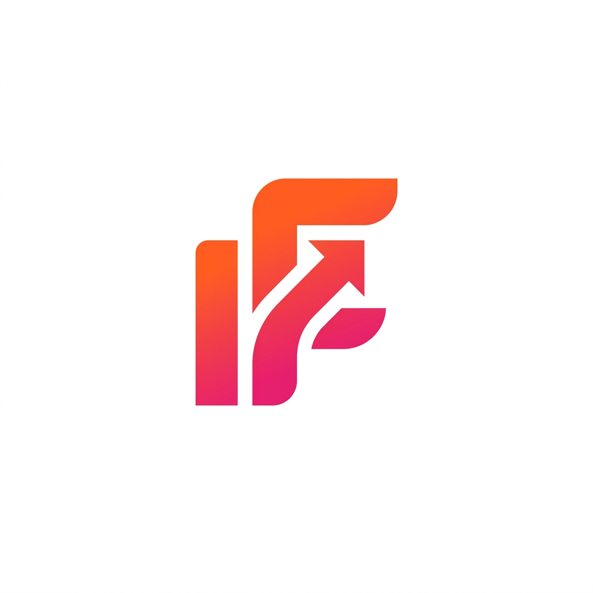
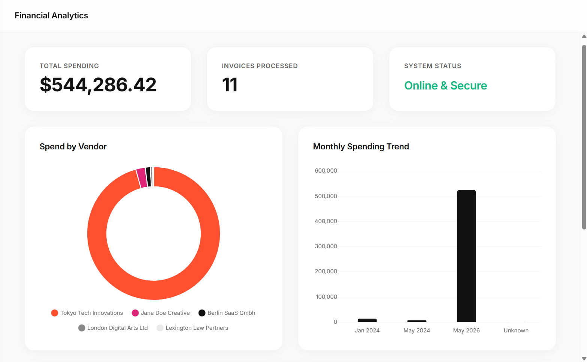
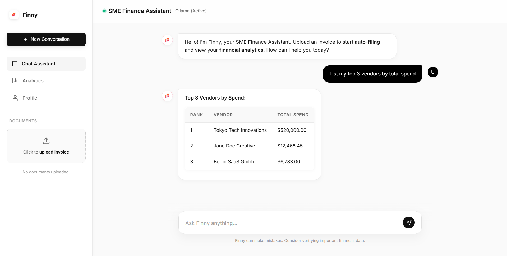
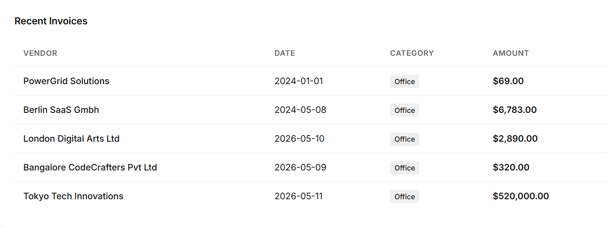
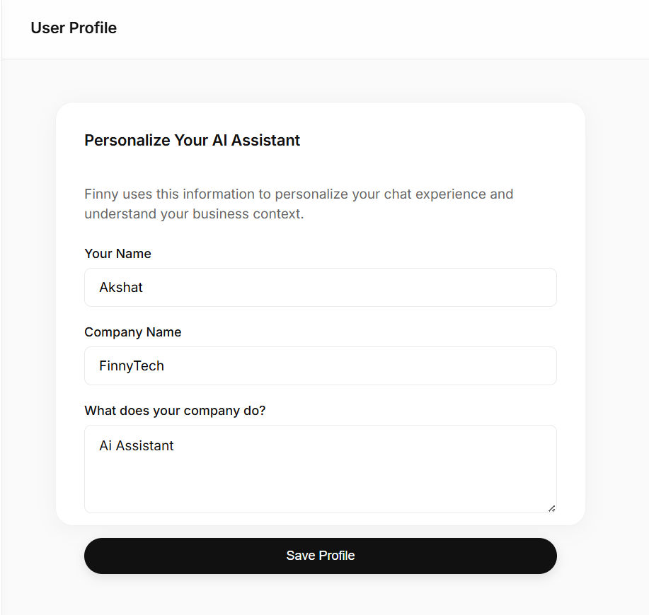

<div align="center">
  
</div>

<h1 align="center">Finny: The SME Intelligence Engine</h1>

<p align="center">
  <strong>A secure, offline-first Conversational AI Assistant and Financial Dashboard designed exclusively for Small and Medium Enterprises (SMEs).</strong>
</p>

<p align="center">
  Powered entirely by local AI models, it guarantees absolute data privacy, zero API subscription costs, and lightning-fast local financial insights.
</p>

<p align="center">
  <a href="#-overview">Overview</a> •
  <a href="#-screenshots">Screenshots</a> •
  <a href="#-features">Features</a> •
  <a href="#-tech-stack">Tech Stack</a> •
  <a href="#-getting-started">Getting Started</a> •
  <a href="#-project-structure">Project Structure</a> •
  <a href="#-api-reference">API Reference</a> •
  <a href="#-security--deployment">Security & Deployment</a> •
  <a href="#-contributing--license">Contributing & License</a>
</p>

<div align="center">
  
  
  
  
  
  
</div>

---

## 📖 Overview

Finny is designed to solve one of the most pressing challenges small and medium businesses face today: **the conflict between adopting artificial intelligence and maintaining strict financial data privacy**. Standard financial intelligence platforms require enterprises to upload highly sensitive documents (invoices, transaction logs, client statements, profit margins) to cloud servers and third-party API providers (like OpenAI, Anthropic, or proprietary accounting tools). For SMEs, this represents a severe compliance liability and a significant data leakage vector.

Finny provides a **100% private, offline-first workspace**. Built on top of local LLMs through **Ollama** (`llama3.2:1b`) and local vector embeddings, all file processing, optical character recognition text extraction, RAG search, and transaction analysis happen directly inside the enterprise's local machine or intranet. Finny automatically parses uploaded PDF invoices, files them systematically in a standard database, feeds them to a secure local vector store, and enables an immersive, natural-language conversation interface equipped with instant SQL shortcuts to instantly pull company analytics.

With a beautiful, modern Glassmorphic user interface, Finny brings enterprise-grade financial analytics and document filing to local systems, ensuring zero external api requests, absolute compliance, and zero operation overhead.

---

## 📸 Screenshots

| **Dashboard** | **ChatWall** |
|:---:|:---:|
|  |  |
| **Recent Invoices** | **Profile** |
|  |  |

### 📊 Dashboard
> Fully interactive financial portal containing aggregated metrics and charts.
*   **Includes:**
    *   **KPI Metrics Cards**: Real-time trackers for *Total Spending* and *Invoices Processed* calculated instantly via SQL queries.
    *   **Spend by Vendor Chart**: A responsive Chart.js doughnut chart detailing exactly where budget chunks are allocated.
    *   **Monthly Spending Trend**: Dynamic bar charts illustrating financial trajectories over time.
    *   **Recent Invoices Table**: Structured dashboard view showing recent transaction dates, vendors, amounts, and categories.

### 💬 ChatWall
> An immersive chatbot experience with memory capability and direct intent routing.
*   **Includes:**
    *   **Natural Language Conversational Box**: Ask any direct question (e.g. *What was our total expense last winter?*).
    *   **AI Streaming Indicator**: Smooth typing animations representing local LLM chunk rendering.
    *   **Pre-Processed Suggestion Chips**: Shortcuts triggering direct SQL pipelines, bypassing LLM speed barriers for rapid analysis.
    *   **Rendered Data Tables**: AI responses styled natively inside sleek Markdown tables.

### 🧾 Recent Invoices
> A secure transaction history tracker coupled with automatic file organization.
*   **Includes:**
    *   **Metadata Tagging**: Automatic categorizations (e.g., Utilities, Cloud, Office, Travel, Other).
    *   **Standardized Sorting**: Table-based review sorted chronologically.

### 👤 Profile
> Personalization dashboard where the chatbot is fine-tuned to your enterprise context.
*   **Includes:**
    *   **User Name Settings**: Personalize chatbot greetings.
    *   **Company Name & Description**: Persistently saves company details into a local SQLite table, automatically injecting metadata into LLM system prompts for deeply personalized corporate context.

---

## ✨ Features

### 💻 Core Functions
*   **Intelligent Auto-Filing**: Ingests PDF bills and automatically extracts crucial financial parameters (vendor, date, total amount, category). Standardizes and renames physical files on the filesystem matching:
    `YYYY-MM-DD_[Vendor]_[OriginalName].pdf`
*   **SQL Metadata Indexing**: Stores document details inside a structural local SQLite database for instantaneous mathematical analytics.

### 🔒 Privacy & Local Security
*   **100% Offline AI Model**: Operates entirely with local Ollama runtimes. No requests, logs, or chat messages ever leave the client's local system.
*   **Local Embeddings Store**: Leverages `ChromaDB` offline instances alongside local `all-MiniLM-L6-v2` HuggingFace Embeddings for document similarity index vector retrieval.

### 📈 Analytics & Charts
*   **Sub-Millisecond Shortcut Analytics**: Intercepts greetings and generic analytics questions using an optimized **$O(1)$ Intent Routing Set** to compute metrics directly from SQLite database, avoiding the execution times of LLMs.
*   **Responsive Charts**: Integrated custom Chart.js palettes to match dark/light Framer-inspired minimalist glassmorphism layouts.

### 🎨 User Experience
*   **Minimalist Glassmorphism Layout**: Translucent CSS filters, soft shadows, vibrant gradients, and elegant hover animations designed for visual comfort.
*   **Streaming Response Pipeline**: Streams textual tokens directly to the client's view as they generate, maintaining fluid, responsive interactions.

---

## 🛠 Tech Stack

| Layer | Technology / Library | Description |
|:---|:---|:---|
| **Frontend** | HTML5, CSS3, Vanilla ES6 JavaScript | Single-Page Application (SPA) utilizing Framer-inspired Glassmorphism design system. |
| **Charts** | Chart.js (v4) | Renders responsive spending trends and vendor donut breakdowns. |
| **Markdown** | Marked.js | Renders streamed chat formatting, lists, bold text, and tables. |
| **Backend API** | FastAPI (Python) | High-performance ASGI framework handling asynchronous file upload, chat routing, and vector searches. |
| **AI Orchestrator** | LangChain | Manages prompt templates, local history memory injection, and LLM chains. |
| **Vector DB** | ChromaDB | Local vector store preserving RAG document chunks in a persistent path. |
| **Embeddings** | HuggingFace (all-MiniLM-L6-v2) | Extracts 384-dimensional dense vectors offline for fast text semantic searches. |
| **Offline LLM** | Ollama (`llama3.2:1b`) | 1B-parameter ultra-fast local LLM with high RAG deterministic behavior (temp=0.0). |
| **Database** | SQLite | Serverless, zero-configuration local database for metadata, profile records, and chat sequences. |
| **File Parsing** | PyMuPDF (`fitz`) | Processes local PDF files to extract structured text elements. |

---

## 🚀 Getting Started

### 📋 Prerequisites
Before launching Finny, ensure you have the following prerequisites installed:
*   **Python**: Version `3.10` or higher.
*   **Ollama**: Install the runtime client from [ollama.com](https://ollama.com) and keep it running locally.

### ⚙️ Step-by-Step Setup

1.  **Clone the Repository**:
    ```bash
    git clone https://github.com/yourusername/BusinessAssistant.git
    cd BusinessAssistant
    ```

2.  **Download the LLM Model**:
    Open a terminal window and pull the lightweight Llama model:
    ```bash
    ollama pull llama3.2:1b
    ```

3.  **Establish Virtual Environment**:
    Create and activate a isolated python virtual environment:
    ```bash
    # Windows
    python -m venv .venv
    .\.venv\Scripts\activate

    # macOS/Linux
    python3 -m venv .venv
    source .venv/bin/activate
    ```

4.  **Install Dependencies**:
    Download and parse backend dependencies using pip:
    ```bash
    pip install -r requirements.txt
    ```

5.  **Start the Engine**:
    Run the FastAPI application. The main script automatically sets up the SQLite schemas:
    ```bash
    python main.py
    ```

6.  **Access the Assistant**:
    Open your web browser and navigate to the local portal:
    ```text
    http://localhost:8000
    ```

### 👤 Local Single-Tenant Account
> **Note:** Finny is designed as a secure, local single-tenant utility application. There are no complicated remote user management tools, OAuth forms, or cloud databases. The application initializes empty and stores your custom profile details securely in your local `business_assistant.db` database.

---

## 📁 Project Structure

```text
BusinessAssistant/
├── chroma_db/                  # Local persistent Chroma vector database path
├── static/                     # Frontend media assets
│   ├── Chatwall.png            # Chat screen preview
│   ├── Dashboard.png           # Financial analytics preview
│   ├── Profile.png             # User configuration preview
│   ├── RecentInvoice.png       # Invoice table preview
│   ├── logo.png                # Circular application logo
│   └── favicon.png             # Application favicon
├── uploads/                    # Secure folder for auto-filed standardized invoices
├── database.py                 # SQLite CRUD controller for KPI, profiles, and logs
├── main.py                     # FastAPI controller, API routes, and LangChain RAG pipeline
├── requirements.txt            # Python dependencies index
├── .env                        # Local environment settings (optional overrides)
└── README.md                   # Technical documentation
```

---

## 🔌 API Reference

### 🔐 Settings & Profiles

#### Get Current Profile
*   **Method**: `GET`
*   **Endpoint**: `/api/profile`
*   **Description**: Retrieves the custom name, company name, and company description from the local SQLite database.

#### Save Profile Changes
*   **Method**: `POST`
*   **Endpoint**: `/api/profile`
*   **Description**: Saves or overwrites the single-profile information in the DB to customize the system prompt context.

### 📁 Ingestion & Analysis

#### Upload & Rename Invoice
*   **Method**: `POST`
*   **Endpoint**: `/upload`
*   **Description**: Receives a PDF file, uses LLM to parse metadata, saves records, files it standardly in `/uploads`, and indexes chunks in `ChromaDB`.

#### Deep Parsing (OCR to JSON)
*   **Method**: `POST`
*   **Endpoint**: `/extract`
*   **Description**: Core agentic pipeline to extract OCR raw text from PDFs and maps it to structural JSON configurations.

### 📊 Queries & Chats

#### Chat Stream
*   **Method**: `POST`
*   **Endpoint**: `/chat`
*   **Description**: Conversational streaming endpoint. Matches intent routes for shortcuts, otherwise queries `ChromaDB` for context chunks and feeds a LangChain pipeline to stream words.

#### Dashboard Aggregations
*   **Method**: `GET`
*   **Endpoint**: `/dashboard-data`
*   **Description**: Computes financial total sum, vendor breakdown percentages, monthly spending logs, and returns them in a structured JSON payload for Chart.js.

---

## 🛡️ Security & Deployment

> [!IMPORTANT]
> **Finny is configured for local intranet deployment and zero-trust local developer operations.** 
> By default, the application runs on `0.0.0.0:8000` inside your private interface. In order to deploy this application to a broader local area network (LAN) or a production container environment, follow these best practices:
> *   **Add HTTPS Encryption**: The local dashboard handles private financial details. Wrap the application using a reverse proxy such as Nginx or Traefik with SSL certificates activated if hosting on shared servers.
> *   **Persistent Volumes**: When utilizing Docker containers, mount your workspace folder, `business_assistant.db`, and `chroma_db/` directory as external volumes so data persists across container rebuilds.
> *   **Ollama Host Overrides**: To host Ollama on a standalone machine, edit the host URL in `main.py` (Line 48) by defining the environment variable `OLLAMA_BASE_URL` to target your custom local network port.

---

## 🤝 Contributing & License

### 👩‍💻 Contributing Rules
1.  **Fork the Repository** on GitHub.
2.  **Create a Feature Branch** (`git checkout -b feature/amazing-improvement`).
3.  **Commit Your Modifications** using semantic prefixes (`git commit -m 'feat: add vision receipt capability'`).
4.  **Push Your Branch** to your fork (`git push origin feature/amazing-improvement`).
5.  **Submit a Pull Request** to merge back to main.

### 📄 License Info
This project is licensed under the terms of the **MIT License**. You can customize, scale, self-host, and commercialize the application completely offline.

---

<p align="center">
  Built with 💖 by the local SME Technology Community to protect corporate financial privacy.
</p>
